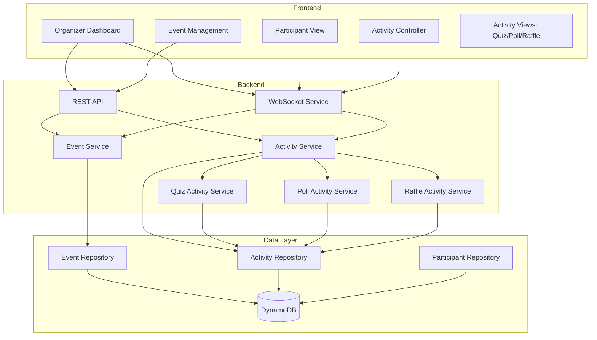

# Design Document: Event Activities Platform

## Overview

This design transforms the existing quiz-centric application into a comprehensive event activities platform. The core architectural shift moves from "Events contain Questions" to "Events contain Activities, where Activities can be Quizzes, Polls, or Raffles." This enables organizers to create multi-faceted interactive experiences while maintaining the real-time, engaging nature of the current system.

The design preserves all existing quiz functionality while introducing a flexible activity framework that supports multiple interaction types. Participants join events (not individual quizzes) and experience whichever activity the organizer activates, creating a unified, seamless experience.

## Architecture

### High-Level Architecture



### Key Architectural Changes

1. **Event-Centric Model**: Events become first-class containers that hold multiple activities
2. **Activity Abstraction**: Introduce an Activity interface that Quiz, Poll, and Raffle implement
3. **Activity State Management**: Track which activity is currently active within an event
4. **Unified Participant Experience**: Single participant view that dynamically renders based on active activity
5. **Backward Compatibility**: Existing quiz data migrates to events with single quiz activities

## Components and Interfaces

### Core Data Models

#### Event Model (Enhanced)
```typescript
interface Event {
  eventId: string;
  name: string;
  gamePin: string;
  organizerId: string;
  status: 'draft' | 'setup' | 'live' | 'completed';
  visibility: 'private' | 'public';
  activeActivityId: string | null;  // NEW: Currently active activity
  createdAt: number;
  lastModified: number;
  startedAt?: number;
  completedAt?: number;
  participantCount: number;
  topic?: string;
  description?: string;
}
```

#### Activity Model (New)
```typescript
type ActivityType = 'quiz' | 'poll' | 'raffle';

type ActivityStatus = 'draft' | 'ready' | 'active' | 'completed';

interface BaseActivity {
  activityId: string;
  eventId: string;
  type: ActivityType;
  name: string;
  status: ActivityStatus;
  order: number;  // Display order in event
  createdAt: number;
  lastModified: number;
}

interface QuizActivity extends BaseActivity {
  type: 'quiz';
  questions: Question[];
  currentQuestionIndex: number;
  scoringEnabled: boolean;
  speedBonusEnabled: boolean;
  streakTrackingEnabled: boolean;
}

interface PollActivity extends BaseActivity {
  type: 'poll';
  question: string;
  options: PollOption[];
  allowMultipleVotes: boolean;
  showResultsLive: boolean;
}

interface RaffleActivity extends BaseActivity {
  type: 'raffle';
  prizeDescription: string;
  entryMethod: 'automatic' | 'manual';
  winnerCount: number;
  winners: string[];  // Participant IDs
}

type Activity = QuizActivity | PollActivity | RaffleActivity;
```

#### Poll-Specific Models
```typescript
interface PollOption {
  id: string;
  text: string;
  voteCount: number;
}

interface PollVote {
  voteId: string;
  pollId: string;
  participantId: string;
  selectedOptionIds: string[];
  submittedAt: number;
}
```

#### Raffle-Specific Models
```typescript
interface RaffleEntry {
  entryId: string;
  raffleId: string;
  participantId: string;
  participantName: string;
  enteredAt: number;
}
```

### Service Layer

#### EventService (Enhanced)
```typescript
interface EventService {
  // Existing methods
  createEvent(name: string, organizerId: string, visibility: string): Promise<Event>;
  getEvent(eventId: string): Promise<Event>;
  updateEvent(eventId: string, updates: Partial<Event>): Promise<Event>;
  deleteEvent(eventId: string): Promise<void>;
  
  // New methods
  setActiveActivity(eventId: string, activityId: string | null): Promise<void>;
  getActiveActivity(eventId: string): Promise<Activity | null>;
  listActivities(eventId: string): Promise<Activity[]>;
}
```

#### ActivityService (New)
```typescript
interface ActivityService {
  createActivity(eventId: string, type: ActivityType, config: any): Promise<Activity>;
  getActivity(activityId: string): Promise<Activity>;
  updateActivity(activityId: string, updates: any): Promise<Activity>;
  deleteActivity(activityId: string): Promise<void>;
  activateActivity(eventId: string, activityId: string): Promise<void>;
  deactivateActivity(eventId: string, activityId: string): Promise<void>;
  
  // Type-specific operations
  getQuizActivity(activityId: string): Promise<QuizActivity>;
  getPollActivity(activityId: string): Promise<PollActivity>;
  getRaffleActivity(activityId: string): Promise<RaffleActivity>;
}
```

#### QuizActivityService (Refactored from existing)
```typescript
interface QuizActivityService {
  addQuestion(activityId: string, question: Question): Promise<void>;
  updateQuestion(activityId: string, questionId: string, updates: Partial<Question>): Promise<void>;
  deleteQuestion(activityId: string, questionId: string): Promise<void>;
  startQuiz(activityId: string): Promise<void>;
  nextQuestion(activityId: string): Promise<Question>;
  endQuiz(activityId: string): Promise<void>;
  submitAnswer(activityId: string, participantId: string, answer: Answer): Promise<AnswerResult>;
}
```

#### PollActivityService (New)
```typescript
interface PollActivityService {
  configurePoll(activityId: string, question: string, options: string[]): Promise<void>;
  startPoll(activityId: string): Promise<void>;
  submitVote(activityId: string, participantId: string, optionIds: string[]): Promise<void>;
  getResults(activityId: string): Promise<PollResults>;
  endPoll(activityId: string): Promise<PollResults>;
}
```

#### RaffleActivityService (New)
```typescript
interface RaffleActivityService {
  configureRaffle(activityId: string, config: RaffleConfig): Promise<void>;
  startRaffle(activityId: string): Promise<void>;
  enterRaffle(activityId: string, participantId: string): Promise<void>;
  drawWinners(activityId: string, count: number): Promise<string[]>;
  endRaffle(activityId: string): Promise<RaffleResults>;
}
```

### WebSocket Events (Enhanced)

#### New Events
```typescript
// Activity lifecycle
'activity-activated': { eventId: string, activity: Activity }
'activity-deactivated': { eventId: string, activityId: string }
'activity-updated': { eventId: string, activity: Activity }

// Poll events
'poll-started': { activityId: string, question: string, options: PollOption[] }
'poll-vote-submitted': { activityId: string, participantId: string }
'poll-results-updated': { activityId: string, results: PollResults }
'poll-ended': { activityId: string, finalResults: PollResults }

// Raffle events
'raffle-started': { activityId: string, prizeDescription: string }
'raffle-entry-confirmed': { activityId: string, participantId: string }
'raffle-drawing': { activityId: string }
'raffle-winners-announced': { activityId: string, winners: RaffleWinner[] }
'raffle-ended': { activityId: string }

// Participant state
'waiting-for-activity': { eventId: string, message: string }
```

### Repository Layer

#### ActivityRepository (New)
```typescript
interface ActivityRepository {
  create(activity: Activity): Promise<Activity>;
  findById(activityId: string): Promise<Activity | null>;
  findByEventId(eventId: string): Promise<Activity[]>;
  update(activityId: string, updates: Partial<Activity>): Promise<Activity>;
  delete(activityId: string): Promise<void>;
  setStatus(activityId: string, status: ActivityStatus): Promise<void>;
}
```

#### PollRepository (New)
```typescript
interface PollRepository {
  createVote(vote: PollVote): Promise<void>;
  getVotes(pollId: string): Promise<PollVote[]>;
  getVoteByParticipant(pollId: string, participantId: string): Promise<PollVote | null>;
  getResults(pollId: string): Promise<PollResults>;
}
```

#### RaffleRepository (New)
```typescript
interface RaffleRepository {
  createEntry(entry: RaffleEntry): Promise<void>;
  getEntries(raffleId: string): Promise<RaffleEntry[]>;
  getEntryByParticipant(raffleId: string, participantId: string): Promise<RaffleEntry | null>;
  setWinners(raffleId: string, winnerIds: string[]): Promise<void>;
}
```

## Data Models

### DynamoDB Table Structure

#### Events Table (Enhanced)
```
Partition Key: eventId
Attributes:
  - name
  - gamePin
  - organizerId
  - status
  - visibility
  - activeActivityId (NEW)
  - createdAt
  - lastModified
  - participantCount
  - topic
  - description
```

#### Activities Table (New)
```
Partition Key: activityId
Sort Key: eventId
Attributes:
  - type (quiz | poll | raffle)
  - name
  - status
  - order
  - config (JSON blob containing type-specific configuration)
  - createdAt
  - lastModified

GSI: EventActivities
  - Partition Key: eventId
  - Sort Key: order
```

#### Questions Table (Modified)
```
Partition Key: questionId
Sort Key: activityId (CHANGED from eventId)
Attributes:
  - text
  - imageUrl
  - options
  - correctOptionId
  - timerSeconds
  - order
```

#### PollVotes Table (New)
```
Partition Key: voteId
Sort Key: pollId
Attributes:
  - participantId
  - selectedOptionIds
  - submittedAt

GSI: PollVotes
  - Partition Key: pollId
  - Sort Key: submittedAt
```

#### RaffleEntries Table (New)
```
Partition Key: entryId
Sort Key: raffleId
Attributes:
  - participantId
  - participantName
  - enteredAt

GSI: RaffleEntries
  - Partition Key: raffleId
  - Sort Key: enteredAt
```

### Migration Strategy

#### Phase 1: Schema Extension
- Add `activeActivityId` to Events table
- Create Activities table
- Create PollVotes table
- Create RaffleEntries table
- Add GSI for event-activity lookups

#### Phase 2: Data Migration
- For each existing event:
  - Create a QuizActivity with all questions
  - Link activity to event
  - Update question records to reference activityId
  - Preserve all existing data

#### Phase 3: Code Migration
- Update EventService to work with activities
- Refactor quiz logic into QuizActivityService
- Update WebSocket handlers
- Update frontend components

#### Phase 4: Cleanup
- Remove deprecated public quiz browsing
- Remove template system (replaced by activity presets)
- Archive migration scripts


## Correctness Properties

*A property is a characteristic or behavior that should hold true across all valid executions of a system—essentially, a formal statement about what the system should do. Properties serve as the bridge between human-readable specifications and machine-verifiable correctness guarantees.*

### Property Reflection

After analyzing all acceptance criteria, several properties can be consolidated:
- Properties 2.1, 2.2, 2.3 (activity creation for different types) can be combined into a single property about activity creation
- Properties 6.2, 6.3, 6.4 (UI rendering for different activity types) can be combined into a single property about activity-specific rendering
- Properties 8.1, 8.2, 8.3, 8.4 (migration aspects) can be combined into a comprehensive migration property

### Core Properties

**Property 1: Event creation produces unique, valid events**
*For any* event creation request with a name and organizerId, the system should generate an event with a unique eventId, unique gamePin, and all required fields populated (name, organizerId, privacy setting, empty activity list).
**Validates: Requirements 1.1, 1.2**

**Property 2: Event updates preserve identity**
*For any* event and any valid field updates, updating the event should change the specified fields while maintaining the same eventId and gamePin.
**Validates: Requirements 1.5**

**Property 3: Event deletion cascades completely**
*For any* event with activities and participants, deleting the event should remove the event, all associated activities, and all participant data, leaving no orphaned records.
**Validates: Requirements 1.4**

**Property 4: Event retrieval is complete**
*For any* event with configured activities, retrieving the event should return all fields including name, join code, privacy setting, and the complete list of activities.
**Validates: Requirements 1.3**

**Property 5: Activity creation succeeds for all types**
*For any* valid activity configuration (quiz, poll, or raffle), creating an activity should produce a valid activity with the correct type, unique activityId, and all configuration fields properly stored.
**Validates: Requirements 2.1, 2.2, 2.3**

**Property 6: Activity deletion is selective**
*For any* event with multiple activities, deleting one activity should remove only that activity while preserving all other activities in the event.
**Validates: Requirements 2.5**

**Property 7: Activity updates preserve identity**
*For any* activity and any configuration updates, updating the activity should change the specified fields while maintaining the same activityId.
**Validates: Requirements 3.5**

**Property 8: Activity configuration remains hidden until activation**
*For any* configured but inactive activity, participants should not be able to see or interact with the activity until it is explicitly activated by the organizer.
**Validates: Requirements 3.4**

**Property 9: Activity activation is mutually exclusive**
*For any* event, activating a new activity should set that activity as active and deactivate any previously active activity, ensuring only one activity is active at a time.
**Validates: Requirements 4.2**

**Property 10: Activity deactivation returns to waiting state**
*For any* event with an active activity, deactivating that activity should set activeActivityId to null and transition participants to the waiting state.
**Validates: Requirements 4.4**

**Property 11: Valid join codes connect to events**
*For any* event with a gamePin, a participant using that gamePin should successfully connect to the corresponding event.
**Validates: Requirements 5.1**

**Property 12: Invalid join codes are rejected**
*For any* join code that doesn't correspond to an existing event, the system should reject the connection attempt and return an error.
**Validates: Requirements 5.2**

**Property 13: Participant registration is complete**
*For any* participant joining an event with a nickname, the system should create a participant record with a unique participantId, the provided nickname, and initial state (score: 0, answers: []).
**Validates: Requirements 5.3**

**Property 14: Session restoration preserves state**
*For any* participant who disconnects and rejoins with the same nickname, the system should restore their previous participantId, score, and answer history.
**Validates: Requirements 5.5**

**Property 15: Activity type determines interface**
*For any* active activity, the participant view should render the interface corresponding to the activity type (quiz interface for quiz activities, poll interface for poll activities, raffle interface for raffle activities).
**Validates: Requirements 6.2, 6.3, 6.4**

**Property 16: Activity transitions update view dynamically**
*For any* event where the active activity changes, all connected participants should receive the new activity data and update their view without requiring a page refresh.
**Validates: Requirements 6.5**

**Property 17: Privacy settings are configurable and enforced**
*For any* event, the organizer should be able to set privacy to either 'private' or 'public', and the setting should be stored and retrievable.
**Validates: Requirements 7.1, 7.4**

**Property 18: Private events are access-controlled**
*For any* event with privacy set to 'private', the event should only be accessible via its join code and should not appear in any public listings.
**Validates: Requirements 7.2**

**Property 19: Migration preserves quiz data completely**
*For any* existing quiz event, the migration process should create a new event structure containing a single quiz activity, where all questions, answers, configuration, gamePin, and privacy settings are preserved exactly.
**Validates: Requirements 8.1, 8.2, 8.3, 8.4**

**Property 20: Reconnection synchronizes state**
*For any* participant who loses and regains connectivity, the system should resynchronize their state with the current active activity and event state.
**Validates: Requirements 9.5**

**Property 21: Quiz activities preserve all features**
*For any* quiz activity, the system should support all existing quiz features including question images, multiple choice answers, speed-based scoring, streak tracking, leaderboards, answer reveal, and podium display.
**Validates: Requirements 10.1, 10.2, 10.3, 10.4**

### Edge Cases

The following edge cases should be handled by the property test generators:

- **Empty events**: Events with no activities
- **Maximum activities**: Events with many activities (stress testing)
- **Rapid activity switching**: Organizer quickly switching between activities
- **Concurrent participant joins**: Many participants joining simultaneously
- **Duplicate nicknames**: Multiple participants attempting to use the same nickname
- **Activity deletion while active**: Deleting the currently active activity
- **Event deletion with active participants**: Deleting an event while participants are connected
- **Malformed activity configurations**: Invalid or incomplete activity data
- **Unicode in names**: Events and activities with special characters
- **Long text fields**: Very long event names, activity descriptions, etc.

## Error Handling

### Error Categories

#### Validation Errors (400)
- Invalid event name (empty, too long)
- Invalid activity type (not quiz/poll/raffle)
- Invalid activity configuration (missing required fields)
- Invalid join code format
- Invalid participant nickname (empty, too long, profanity)

#### Not Found Errors (404)
- Event not found
- Activity not found
- Participant not found
- Join code not found

#### Conflict Errors (409)
- Duplicate activity name within event
- Activity already active
- Participant nickname already taken
- Cannot delete active activity

#### Authorization Errors (403)
- Organizer attempting to modify another organizer's event
- Participant attempting organizer-only actions

#### State Errors (422)
- Cannot activate activity in draft status
- Cannot start quiz with no questions
- Cannot draw raffle winners with no entries
- Cannot end poll that hasn't started

### Error Response Format

```typescript
interface ErrorResponse {
  error: string;
  message: string;
  code: string;
  details?: any;
}
```

### Error Recovery Strategies

1. **Transient Failures**: Automatic retry with exponential backoff for network/database errors
2. **State Inconsistencies**: Periodic reconciliation jobs to detect and fix orphaned records
3. **WebSocket Disconnections**: Automatic reconnection with state resynchronization
4. **Partial Failures**: Rollback transactions to maintain consistency
5. **Validation Failures**: Clear error messages with actionable guidance

## Testing Strategy

### Unit Testing

Unit tests will cover:
- **Service layer logic**: Event creation, activity management, state transitions
- **Repository operations**: CRUD operations, queries, data transformations
- **Validation logic**: Input validation, business rule enforcement
- **Utility functions**: Join code generation, nickname validation, data formatting
- **Error handling**: Error detection, error message generation, error recovery

Example unit tests:
- Creating an event with valid data succeeds
- Creating an event with empty name fails with validation error
- Activating an activity sets activeActivityId correctly
- Deleting an event removes all activities
- Invalid join code returns 404 error

### Property-Based Testing

Property-based tests will verify universal properties across all inputs using **fast-check** (JavaScript/TypeScript property testing library). Each test will run a minimum of 100 iterations with randomly generated inputs.

**Configuration**:
- Library: fast-check
- Minimum iterations: 100 per property
- Timeout: 30 seconds per property
- Shrinking: Enabled (to find minimal failing cases)

**Test Organization**:
- Each correctness property will be implemented as a single property-based test
- Tests will be tagged with comments referencing the design document property
- Tag format: `// Feature: event-activities-platform, Property {number}: {property_text}`

**Generators**:
Custom generators will be created for:
- Events (with various states, privacy settings, activity counts)
- Activities (quiz/poll/raffle with valid configurations)
- Participants (with various nicknames, scores, states)
- Join codes (valid and invalid formats)
- Activity configurations (questions, poll options, raffle settings)

**Example property tests**:
- Property 1: Generate random event creation requests, verify unique IDs and complete data
- Property 9: Generate events with activities, activate multiple in sequence, verify mutual exclusion
- Property 19: Generate old-format quizzes, run migration, verify data preservation

### Integration Testing

Integration tests will verify:
- **End-to-end flows**: Complete organizer and participant workflows
- **WebSocket communication**: Real-time event broadcasting and state synchronization
- **Database operations**: Multi-table transactions, cascade deletes, GSI queries
- **API endpoints**: Request/response handling, error cases, authentication
- **Migration process**: Old data to new schema conversion

Example integration tests:
- Organizer creates event, adds activities, activates quiz, participants join and answer
- Participant joins event, sees waiting state, quiz activates, participant sees quiz interface
- Migration script converts existing quizzes to new format, all data accessible

### Performance Testing

Performance tests will verify:
- **Concurrent participants**: 100+ participants joining and interacting simultaneously
- **Activity switching**: Rapid activation/deactivation without lag
- **WebSocket broadcasting**: Sub-500ms message delivery to all participants
- **Database queries**: Sub-100ms response times for event/activity lookups
- **Migration speed**: Process 1000+ events in under 5 minutes

## Implementation Notes

### Backward Compatibility

During the transition period:
1. Maintain existing API endpoints with deprecation warnings
2. Support both old and new data formats in repositories
3. Provide migration tools for gradual rollout
4. Keep existing quiz functionality fully operational

### Phased Rollout

**Phase 1: Foundation** (Week 1-2)
- Implement Activity data models and repositories
- Create ActivityService with basic CRUD
- Update Event model with activeActivityId
- Migration script for existing data

**Phase 2: Quiz Integration** (Week 2-3)
- Refactor quiz logic into QuizActivityService
- Update WebSocket events for activity lifecycle
- Modify frontend to work with activities
- End-to-end testing of quiz activities

**Phase 3: Poll Implementation** (Week 3-4)
- Implement PollActivityService
- Create poll UI components
- Add poll WebSocket events
- Testing and refinement

**Phase 4: Raffle Implementation** (Week 4-5)
- Implement RaffleActivityService
- Create raffle UI components
- Add raffle WebSocket events
- Testing and refinement

**Phase 5: Cleanup** (Week 5-6)
- Remove deprecated code
- Remove public quiz browsing
- Performance optimization
- Documentation updates

### Technology Stack

- **Backend**: Node.js, Express, Socket.io, TypeScript
- **Frontend**: React, TypeScript, TailwindCSS
- **Database**: DynamoDB with GSIs
- **Testing**: Vitest (unit), fast-check (property-based), Playwright (integration)
- **Real-time**: Socket.io for WebSocket communication
- **Deployment**: AWS (ECS, CloudFront, S3)
