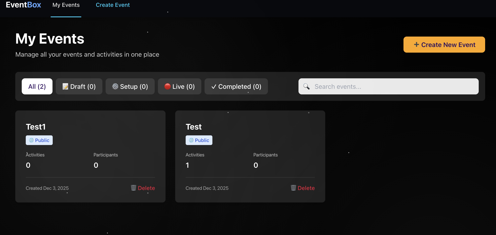
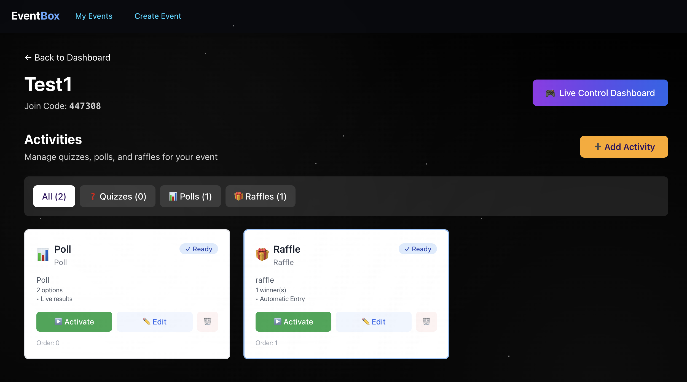
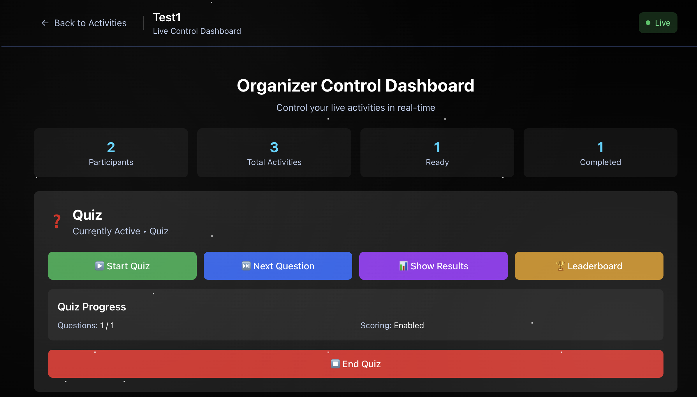
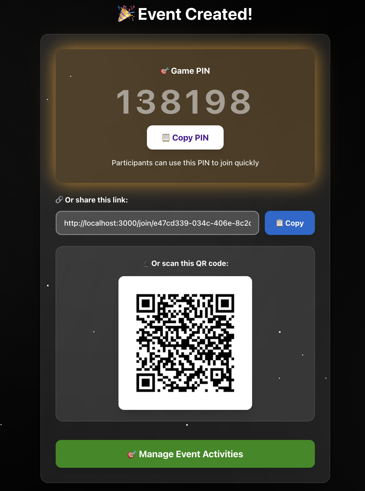
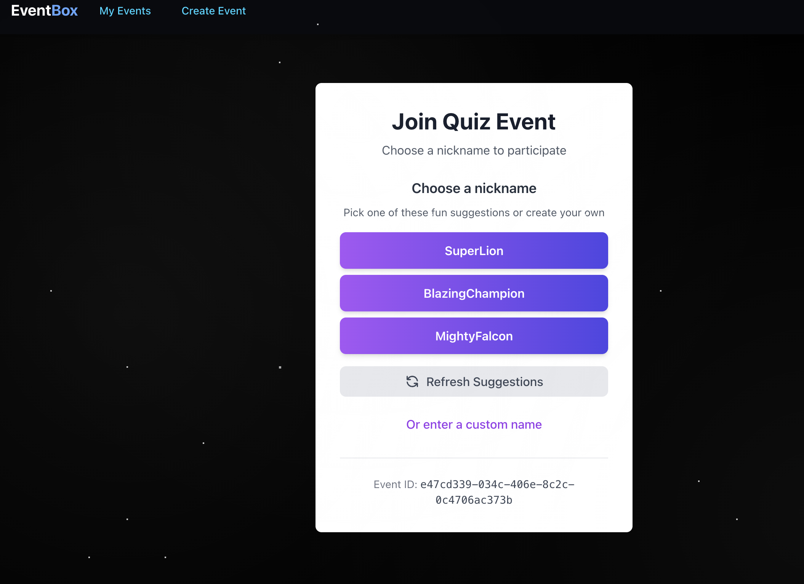
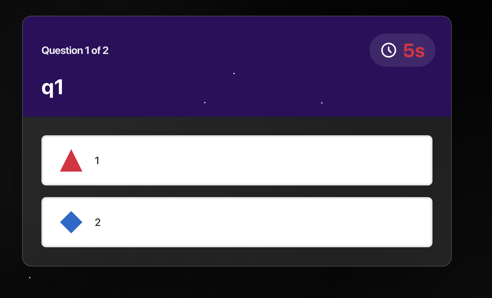
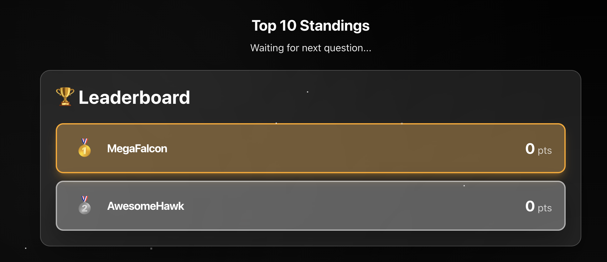
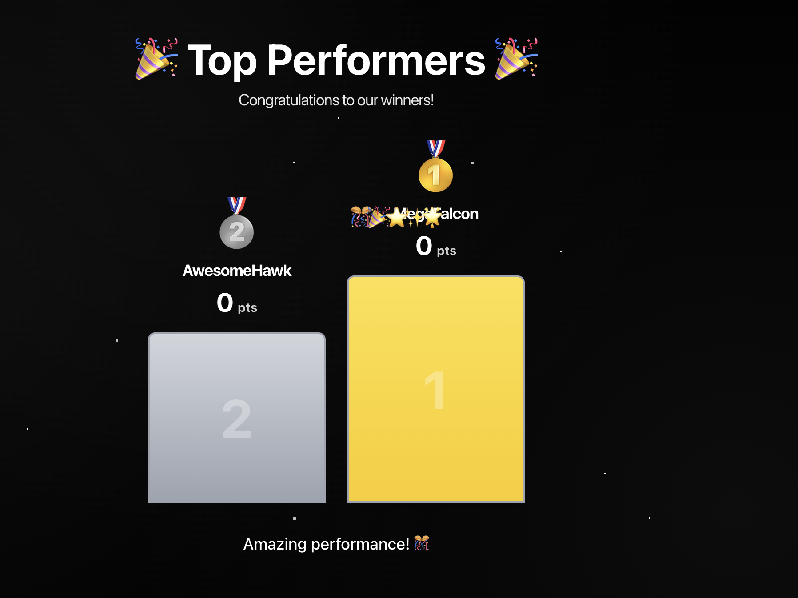

# EventBox - Unified Event Engagement Platform

> **One platform, endless engagement.** Switch seamlessly between quizzes, polls, and raffles without losing your audience.


[](http://live-quiz-frontend-333105300941.s3-website-us-east-1.amazonaws.com)
[](https://aws.amazon.com)
[](./LICENSE)

---

## 📖 Table of Contents

- [The Problem](#-the-problem)
- [The Solution](#-the-solution)
- [Key Features](#-key-features)
- [Screenshots](#-screenshots)
- [Quick Start](#-quick-start)
- [Architecture](#-architecture)
- [Technology Stack](#-technology-stack)
- [Documentation](#-documentation)
- [Development](#-development)
- [Deployment](#-deployment)
- [Contributing](#-contributing)

---

## 🎯 The Problem

Event organizers face a common challenge: **keeping audiences engaged throughout their events**. Currently, they're forced to juggle multiple platforms—one for quizzes, another for raffles, a third for polls—creating a disjointed experience that breaks the flow and loses audience attention.

**What happens when:**
- Your presentation runs short and you need to fill time?
- The audience seems disengaged and you need an icebreaker?
- Technical difficulties require a quick pivot to keep people entertained?

---

## ✨ The Solution

**EventBox** is a unified platform where organizers can seamlessly switch between different engagement activities without losing their audience or breaking the experience flow.

### Core Innovation: Event-Based Architecture

Participants join an **event**, not individual activities. Once connected, organizers can instantly switch between:

- 🎯 **Quizzes** - Interactive Q&A with real-time scoring
- 📊 **Polls** - Instant audience feedback and voting
- 🎁 **Raffles** - Prize drawings and giveaways

**No page refreshes. No re-joining. No lost participants.**

---

## 🚀 Key Features

### For Organizers

#### 🎮 **Unified Event Management**
- Create events with multiple pre-configured activities
- Switch between activities instantly during live events
- Monitor participant engagement in real-time
- Control everything from a single dashboard




#### 🎯 **Activity Control Panel**
- See all activities for your event at a glance
- Start, pause, or end activities with one click
- View live participant counts
- Switch activities seamlessly



#### 📊 **Real-Time Monitoring**
- See who's joined your event
- Track participant responses live
- View results as they come in
- Export data for analysis



### For Participants

#### 📱 **Instant Joining**
- Scan QR code or enter 6-digit PIN
- Join from any device (phone, tablet, laptop)
- No app download required
- Works on any modern browser



#### 🎨 **Beautiful, Intuitive Interface**
- Mobile-first responsive design
- Large, touch-friendly buttons
- Smooth animations and transitions
- Clear visual feedback



#### ⚡ **Real-Time Updates**
- See new activities instantly (< 500ms)
- Live score updates
- Instant result reveals
- No page refreshes needed

---

## 🎯 Activity Types

### 1. Interactive Quizzes

**Engage your audience with knowledge challenges**

- ✅ Multiple choice questions with 2-4 options
- 🎨 Colorful geometric answer buttons (triangle, diamond, circle, square)
- ⚡ Speed-based scoring (500-1000 points)
- 🖼️ Support for question images
- 📊 Live leaderboard with rankings
- 🏆 Podium display for top 3 winners
- 🔥 Answer streak tracking
- 📈 Answer distribution statistics







### 2. Live Polls

**Get instant feedback from your audience**

- 🗳️ Single or multiple choice voting
- 📊 Real-time vote count updates
- 📈 Visual results with bar charts
- 🎯 Unlimited voting options
- 🔒 Results hidden until poll ends (configurable)
- 📱 Mobile-optimized voting interface

### 3. Prize Raffles

**Create excitement with prize drawings**

- 🎲 Fair random winner selection (Fisher-Yates algorithm)
- 🎟️ Automatic or manual entry methods
- 🏆 Support for multiple winners
- 🎉 Animated winner reveals
- 🎁 Prize description display
- 📊 Entry tracking and management

## 🚀 Quick Start

### Prerequisites

- Node.js 18+ and npm
- Docker Desktop (for local DynamoDB)

### Run Locally in 3 Steps

1. **Start Docker Desktop** (make sure it's running)

2. **Install and start everything:**
   ```bash
   npm install
   npm run dev
   ```

3. **Open your browser:**
   ```
   http://localhost:5173
   ```

That's it! You're ready to create your first event! 🎉

**Detailed Setup:** See [START_HERE.md](./START_HERE.md) for step-by-step instructions.

---

## 🏗️ Architecture

EventBox uses a modern, cloud-native architecture designed for real-time engagement:


*Screenshot 20: System architecture diagram*

### Cloud-Native Infrastructure

```
┌─────────────────────────────────────────────────────────────┐
│                     CloudFront CDN                          │
│                  (Global Distribution)                      │
└────────────────────┬────────────────────────────────────────┘
                     │
        ┌────────────┴────────────┐
        │                         │
┌───────▼────────┐       ┌───────▼────────┐
│   S3 Bucket    │       │   ALB + ECS    │
│   (Frontend)   │       │   (Backend)    │
└────────────────┘       └───────┬────────┘
                                 │
                    ┌────────────┴────────────┐
                    │                         │
            ┌───────▼────────┐       ┌───────▼────────┐
            │   DynamoDB     │       │  WebSocket     │
            │   (Database)   │       │  (Real-time)   │
            └────────────────┘       └────────────────┘
```

### Key Components

- **Frontend**: React SPA served via CloudFront CDN
- **Backend**: Node.js API on ECS Fargate (auto-scaling)
- **Database**: DynamoDB for millisecond response times
- **Real-time**: WebSocket connections for instant updates
- **Media**: S3 + CloudFront for images and assets

### Performance Metrics

- ⚡ **Activity Switching**: < 500ms
- 🚀 **WebSocket Latency**: < 100ms
- 📱 **Mobile Load Time**: < 3s
- 👥 **Concurrent Users**: 50+ tested
- 🌍 **Global Reach**: CloudFront CDN

---

## 🛠️ Technology Stack

### Frontend
- **React 18** - Modern UI library
- **TypeScript** - Type-safe development
- **Vite** - Lightning-fast build tool
- **Socket.io Client** - Real-time communication
- **React Router** - Client-side routing
- **Framer Motion** - Smooth animations
- **Tailwind CSS** - Utility-first styling

### Backend
- **Node.js** - JavaScript runtime
- **Express** - Web framework
- **Socket.io** - WebSocket server
- **TypeScript** - Type-safe backend
- **AWS SDK** - Cloud services integration

### Infrastructure
- **AWS DynamoDB** - NoSQL database
- **AWS ECS Fargate** - Containerized backend
- **AWS S3** - Static file hosting
- **AWS CloudFront** - Global CDN
- **AWS ALB** - Load balancing
- **AWS CDK** - Infrastructure as Code

---

## 📚 Documentation

### Getting Started
- 📖 **[START_HERE.md](./START_HERE.md)** - Quick 3-step setup guide
- 🔧 **[LOCAL_DEVELOPMENT.md](./LOCAL_DEVELOPMENT.md)** - Detailed local setup

### API Documentation
- 📚 **[API Documentation Index](./API_DOCUMENTATION_INDEX.md)** - Complete guide
- 🔌 **[API Reference](./API_DOCUMENTATION.md)** - REST API endpoints
- ⚡ **[WebSocket Events](./WEBSOCKET_EVENTS_REFERENCE.md)** - Real-time events
- 📋 **[API Quick Reference](./API_QUICK_REFERENCE.md)** - Quick lookups

### Deployment
- 🚀 **[Phase 2 Quick Start](./PHASE2_QUICK_START.md)** - Deploy in 3 steps
- ☁️ **[Deployment Guide](./DEPLOYMENT.md)** - AWS deployment
- 🏗️ **[Infrastructure Guide](./infrastructure/README.md)** - CDK details

### Migration & Testing
- 🔄 **[Migration Guide](./MIGRATION_GUIDE.md)** - Migrate existing data
- ✅ **[Deployment Verification](./DEPLOYMENT_VERIFICATION.md)** - Testing checklist
- 🧪 **[Integration Tests](./INTEGRATION_TESTS_SUMMARY.md)** - Test suite

---

## 💻 Development

### Project Structure

```
eventbox/
├── frontend/              # React + Vite frontend
│   ├── src/
│   │   ├── components/   # Reusable UI components
│   │   ├── pages/        # Page components
│   │   ├── contexts/     # React contexts
│   │   ├── hooks/        # Custom hooks
│   │   └── types/        # TypeScript types
│   └── public/           # Static assets
│
├── backend/              # Node.js + Express backend
│   ├── src/
│   │   ├── routes/       # API endpoints
│   │   ├── services/     # Business logic
│   │   ├── db/           # Database repositories
│   │   └── types/        # TypeScript types
│   └── __tests__/        # Test files
│
├── infrastructure/       # AWS CDK infrastructure
│   └── lib/              # CDK stack definitions
│
├── scripts/              # Utility scripts
│   ├── deploy-phase2.sh  # Deployment script
│   └── test-*.sh         # Testing scripts
│
└── docker-compose.yml    # Local DynamoDB setup
```

### Development Workflow

1. **Create an Event**
   ```
   Open http://localhost:5173
   → Click "Create Event"
   → Enter event details
   → Click "Create Event"
   ```

2. **Add Activities**
   ```
   → Click "Add Activity"
   → Choose type (Quiz/Poll/Raffle)
   → Configure activity
   → Save
   ```

3. **Join as Participant**
   ```
   → Copy 6-digit PIN
   → Open new browser window
   → Enter PIN and nickname
   → Join event
   ```

4. **Run Activities**
   ```
   → Activate activity from control panel
   → Participants see it automatically
   → Switch activities seamlessly
   → View real-time results
   ```

### Useful Commands

```bash
# Development
npm run dev                    # Start everything (recommended)
npm run dev:frontend           # Frontend only
npm run dev:backend            # Backend only

# Database
npm run db:start               # Start local DynamoDB
npm run db:stop                # Stop DynamoDB
npm run db:admin               # Open admin UI
npm run setup:local-db         # Create tables

# Building
npm run build:frontend         # Build frontend
npm run build:backend          # Build backend

# Deployment
npm run deploy:infrastructure  # Deploy AWS infra
npm run deploy:backend         # Deploy backend
npm run deploy:frontend        # Deploy frontend

# Code Quality
npm run lint                   # Lint code
npm run format                 # Format with Prettier
npm run test                   # Run tests
```

---

## 🚀 Deployment

### Quick Deploy to AWS

```bash
# Deploy everything (infrastructure + backend + frontend)
./scripts/deploy-phase2.sh production

# Test deployment
./scripts/test-phase2-features.sh production
```

### Manual Deployment

```bash
# 1. Deploy infrastructure
cd infrastructure
npm run deploy

# 2. Deploy backend
cd ../backend
npm run build
./deploy-backend.sh

# 3. Deploy frontend
cd ../frontend
npm run build
aws s3 sync dist/ s3://your-bucket --delete
aws cloudfront create-invalidation --distribution-id YOUR_ID --paths "/*"
```

**Detailed Instructions:** See [DEPLOYMENT.md](./DEPLOYMENT.md)

---

## 🎯 Use Cases

### Corporate Events
- **Town Halls**: Engage employees with live polls and Q&A
- **Training Sessions**: Test knowledge with interactive quizzes
- **Team Building**: Run raffles and icebreaker activities

### Education
- **Lectures**: Check understanding with quick polls
- **Workshops**: Interactive quizzes for learning assessment
- **Student Events**: Raffles and engagement activities

### Conferences
- **Keynotes**: Keep audiences engaged between speakers
- **Breakout Sessions**: Interactive polls for feedback
- **Networking**: Icebreakers and team formation

### Virtual Events
- **Webinars**: Combat Zoom fatigue with interactive elements
- **Online Meetups**: Build community with shared activities
- **Remote Training**: Assess learning with quizzes

---

## 🔮 Roadmap

### Planned Features

#### **Team Activities**
- 🤝 **Team Split**: Divide audience into collaborative groups
- 🎯 **Team Challenges**: Group-based competitions
- 📊 **Team Leaderboards**: Track team performance

#### **Advanced Engagement**
- 🎲 **Pick One**: Random audience member selection
- 🤖 **Random Quiz**: AI-generated questions on-the-fly
- 🧊 **Icebreakers**: Quick warm-up activities
- 💬 **Q&A Sessions**: Moderated question collection

#### **Analytics & Insights**
- 📈 **Engagement Metrics**: Track participation rates
- 📊 **Response Analytics**: Analyze answer patterns
- 📉 **Trend Analysis**: Historical engagement data
- 📧 **Export Reports**: Download results and analytics

#### **Platform Enhancements**
- 🎨 **Custom Branding**: White-label options
- 🌍 **Multi-language**: Internationalization support
- 🔐 **Advanced Security**: SSO and role-based access
- 📱 **Native Apps**: iOS and Android applications
---

## 📄 License

MIT License - see [LICENSE](./LICENSE) for details

---

## 🙏 Acknowledgments

- Built with [Kiro AI](https://kiro.ai) - AI-assisted development
- Powered by [AWS](https://aws.amazon.com) - Cloud infrastructure
- Inspired by the need for better event engagement tools

---

## 🌟 Why EventBox?

### **For Organizers**
- ✅ One platform for all engagement needs
- ✅ Seamless activity switching
- ✅ Real-time audience insights
- ✅ Professional, polished experience

### **For Participants**
- ✅ No app downloads required
- ✅ Works on any device
- ✅ Smooth, intuitive interface
- ✅ Instant feedback and results

### **For Developers**
- ✅ Modern tech stack
- ✅ Clean, maintainable code
- ✅ Comprehensive documentation
- ✅ Easy to extend and customize

---

<div align="center">

**Built with ❤️ using React, Node.js, and AWS**

[Live Demo](https://your-demo-url.com) • [Documentation](./API_DOCUMENTATION_INDEX.md) • [GitHub](https://github.com/your-repo)

</div>
