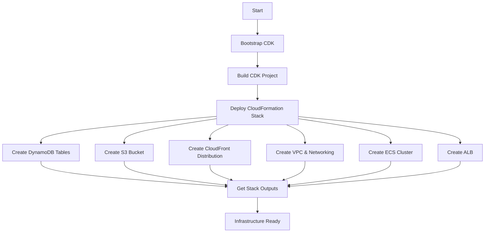
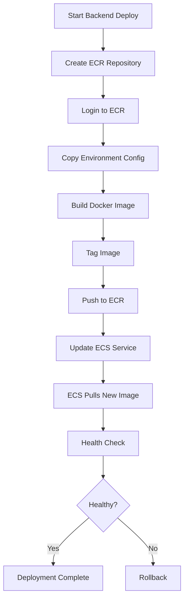
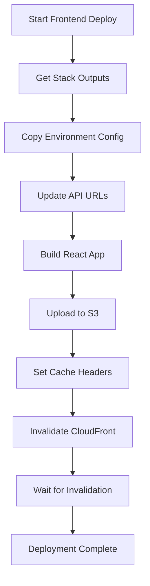
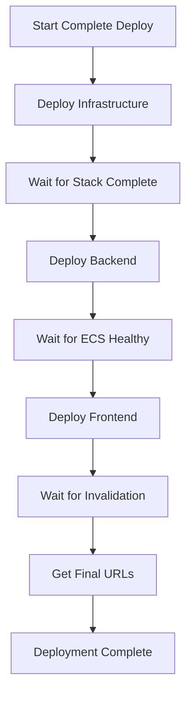

# Deployment Workflow

This document describes the deployment workflow and process for the Live Quiz Event System.

## Deployment Architecture

```
┌─────────────────────────────────────────────────────────────┐
│                     Developer Machine                        │
│                                                              │
│  ┌──────────────┐  ┌──────────────┐  ┌──────────────┐     │
│  │   Frontend   │  │   Backend    │  │Infrastructure│     │
│  │    Build     │  │ Docker Build │  │  CDK Deploy  │     │
│  └──────┬───────┘  └──────┬───────┘  └──────┬───────┘     │
│         │                  │                  │              │
└─────────┼──────────────────┼──────────────────┼──────────────┘
          │                  │                  │
          ▼                  ▼                  ▼
┌─────────────────────────────────────────────────────────────┐
│                         AWS Cloud                            │
│                                                              │
│  ┌──────────────┐  ┌──────────────┐  ┌──────────────┐     │
│  │      S3      │  │     ECR      │  │ CloudFormation│     │
│  │  + CloudFront│  │   + ECS      │  │              │     │
│  └──────────────┘  └──────────────┘  └──────────────┘     │
│                                                              │
└─────────────────────────────────────────────────────────────┘
```

## Workflow Stages

### Stage 1: Infrastructure Deployment (First Time Only)



**Commands**:
```bash
cd infrastructure
cdk bootstrap
npm run build
cdk deploy
```

### Stage 2: Backend Deployment



**Commands**:
```bash
npm run deploy:backend production
```

**What Happens**:
1. Script validates environment parameter
2. Creates ECR repository if it doesn't exist
3. Authenticates with ECR
4. Copies `.env.production` to build context
5. Builds Docker image with multi-stage build
6. Tags image with `latest` and timestamp
7. Pushes both tags to ECR
8. Forces new ECS deployment
9. ECS pulls new image and starts tasks
10. ALB health checks verify tasks are healthy

### Stage 3: Frontend Deployment



**Commands**:
```bash
npm run deploy:frontend production
```

**What Happens**:
1. Script fetches S3 bucket and CloudFront distribution ID from stack
2. Copies `.env.production` and updates with actual backend URL
3. Builds React app with Vite (outputs to `dist/`)
4. Uploads all files to S3 with appropriate cache headers:
   - Static assets: 1 year cache
   - index.html: no cache
5. Creates CloudFront invalidation for all paths
6. Monitors invalidation status

### Stage 4: Complete Deployment



**Commands**:
```bash
npm run deploy:all production
```

**What Happens**:
1. Deploys infrastructure (CDK)
2. Deploys backend (Docker + ECS)
3. Deploys frontend (S3 + CloudFront)
4. Outputs final URLs

## Environment-Specific Workflows

### Development Environment

```bash
# Deploy to development
npm run deploy:dev
```

**Characteristics**:
- Stack name: `LiveQuizEventStack-development`
- ECR repository: `live-quiz-backend-development`
- ECS cluster: `live-quiz-cluster-development`
- Smaller resources (1 ECS task, 1 NAT gateway)
- Faster iteration

### Staging Environment

```bash
# Deploy to staging
npm run deploy:staging
```

**Characteristics**:
- Stack name: `LiveQuizEventStack-staging`
- ECR repository: `live-quiz-backend-staging`
- ECS cluster: `live-quiz-cluster-staging`
- Production-like configuration
- Pre-production testing

### Production Environment

```bash
# Deploy to production
npm run deploy:prod
```

**Characteristics**:
- Stack name: `LiveQuizEventStack`
- ECR repository: `live-quiz-backend`
- ECS cluster: `live-quiz-cluster`
- Full resources (multiple tasks, HA setup)
- Monitoring and alerting

## Deployment Patterns

### Pattern 1: Hotfix Deployment

For urgent bug fixes:

```bash
# 1. Fix the bug in code
# 2. Test locally
npm run dev

# 3. Deploy only affected component
npm run deploy:backend production  # If backend fix
# or
npm run deploy:frontend production # If frontend fix

# 4. Verify fix
# 5. Monitor logs
```

### Pattern 2: Feature Deployment

For new features:

```bash
# 1. Develop feature locally
# 2. Test thoroughly
# 3. Deploy to development
npm run deploy:dev

# 4. Test in development
# 5. Deploy to staging
npm run deploy:staging

# 6. Test in staging
# 7. Deploy to production
npm run deploy:prod

# 8. Monitor and verify
```

### Pattern 3: Infrastructure Update

For infrastructure changes:

```bash
# 1. Update CDK code
# 2. Review changes
cd infrastructure
cdk diff

# 3. Deploy infrastructure
cdk deploy

# 4. Redeploy backend (if needed)
npm run deploy:backend production

# 5. Redeploy frontend (if needed)
npm run deploy:frontend production
```

### Pattern 4: Rollback

If deployment fails:

```bash
# Backend rollback
aws ecs list-task-definitions --family-prefix websocket-task --sort DESC
aws ecs update-service \
  --cluster live-quiz-cluster \
  --service websocket-service \
  --task-definition websocket-task:PREVIOUS_REVISION

# Frontend rollback
# Redeploy previous version
npm run deploy:frontend production

# Infrastructure rollback
cd infrastructure
cdk deploy --rollback
```

## Build Process Details

### Frontend Build

```bash
npm run build:frontend
```

**Steps**:
1. TypeScript compilation (`tsc`)
2. Vite build process:
   - Bundle JavaScript/TypeScript
   - Process CSS with Tailwind
   - Optimize assets
   - Generate source maps
   - Output to `frontend/dist/`

**Output Structure**:
```
frontend/dist/
├── index.html
├── assets/
│   ├── index-[hash].js
│   ├── index-[hash].css
│   └── [other assets]
└── [other files]
```

### Backend Build

```bash
npm run build:backend
```

**Steps**:
1. TypeScript compilation (`tsc`)
2. Output to `backend/dist/`
3. Preserves directory structure

**Output Structure**:
```
backend/dist/
├── index.js
├── db/
│   ├── client.js
│   └── repositories/
├── middleware/
├── routes/
├── services/
└── types/
```

### Docker Build

```bash
docker build -t live-quiz-backend:latest backend/
```

**Multi-Stage Build**:

**Stage 1: Builder**
- Base: `node:20-alpine`
- Install all dependencies
- Copy source code
- Compile TypeScript

**Stage 2: Production**
- Base: `node:20-alpine`
- Install production dependencies only
- Copy compiled code from builder
- Create non-root user
- Set up health check
- Expose port 3000

**Image Size**: ~150-200 MB

## Deployment Timeline

### Initial Deployment (First Time)

| Step | Duration | Description |
|------|----------|-------------|
| CDK Bootstrap | 2-3 min | One-time setup |
| Infrastructure Deploy | 10-15 min | Create all AWS resources |
| Backend Build & Push | 3-5 min | Build and push Docker image |
| ECS Service Start | 2-3 min | Start ECS tasks |
| Frontend Build | 1-2 min | Build React app |
| S3 Upload | 1-2 min | Upload to S3 |
| CloudFront Invalidation | 10-15 min | Invalidate cache |
| **Total** | **30-45 min** | Complete initial deployment |

### Subsequent Deployments

| Component | Duration | Description |
|-----------|----------|-------------|
| Backend Only | 5-8 min | Build, push, deploy |
| Frontend Only | 12-17 min | Build, upload, invalidate |
| Infrastructure Only | 5-10 min | Update stack |
| Complete Stack | 20-30 min | All components |

## Monitoring Deployment

### Real-Time Monitoring

```bash
# Watch ECS deployment
watch -n 5 'aws ecs describe-services \
  --cluster live-quiz-cluster \
  --services websocket-service \
  --query "services[0].deployments"'

# Follow logs
aws logs tail /ecs/live-quiz-websocket-server --follow

# Check CloudFront invalidation
aws cloudfront get-invalidation \
  --distribution-id DISTRIBUTION_ID \
  --id INVALIDATION_ID
```

### Health Checks

```bash
# Backend health
curl http://ALB_URL/health

# Frontend health
curl https://CLOUDFRONT_URL/

# WebSocket connection
wscat -c ws://ALB_URL
```

## Deployment Best Practices

1. **Always deploy to development first**
2. **Test thoroughly in staging**
3. **Deploy during low-traffic periods**
4. **Monitor logs during deployment**
5. **Have rollback plan ready**
6. **Document deployment notes**
7. **Verify health checks pass**
8. **Test end-to-end functionality**
9. **Monitor for 24 hours post-deployment**
10. **Keep deployment scripts updated**

## Automation Opportunities

### CI/CD Pipeline (Future)

```yaml
# Example GitHub Actions workflow
name: Deploy to Production

on:
  push:
    branches: [main]

jobs:
  deploy:
    runs-on: ubuntu-latest
    steps:
      - uses: actions/checkout@v2
      - name: Configure AWS credentials
        uses: aws-actions/configure-aws-credentials@v1
      - name: Deploy
        run: npm run deploy:prod
```

### Automated Testing

```bash
# Run tests before deployment
npm test
npm run lint
npm run build:frontend
npm run build:backend
```

### Deployment Notifications

```bash
# Send Slack notification
curl -X POST -H 'Content-type: application/json' \
  --data '{"text":"Deployment to production started"}' \
  SLACK_WEBHOOK_URL
```

## Troubleshooting Deployments

### Common Issues

1. **Docker build fails**: Check Dockerfile syntax and dependencies
2. **ECR push fails**: Verify AWS credentials and permissions
3. **ECS tasks fail**: Check CloudWatch logs and environment variables
4. **Frontend not loading**: Verify S3 upload and CloudFront invalidation
5. **WebSocket fails**: Check ALB health checks and security groups

### Debug Commands

```bash
# Check Docker
docker ps
docker images

# Check AWS resources
aws ecs describe-services --cluster live-quiz-cluster --services websocket-service
aws s3 ls s3://BUCKET_NAME/
aws cloudfront list-distributions

# Check logs
aws logs tail /ecs/live-quiz-websocket-server --follow
```

## Next Steps

1. Review [Deployment Checklist](./DEPLOYMENT_CHECKLIST.md)
2. Follow [Deployment Guide](./DEPLOYMENT_GUIDE.md)
3. Use [Quick Commands](./DEPLOYMENT_COMMANDS.md)
4. Read [Deployment Configuration](./DEPLOYMENT_CONFIG.md)
5. Set up CI/CD pipeline
6. Configure monitoring and alerting
